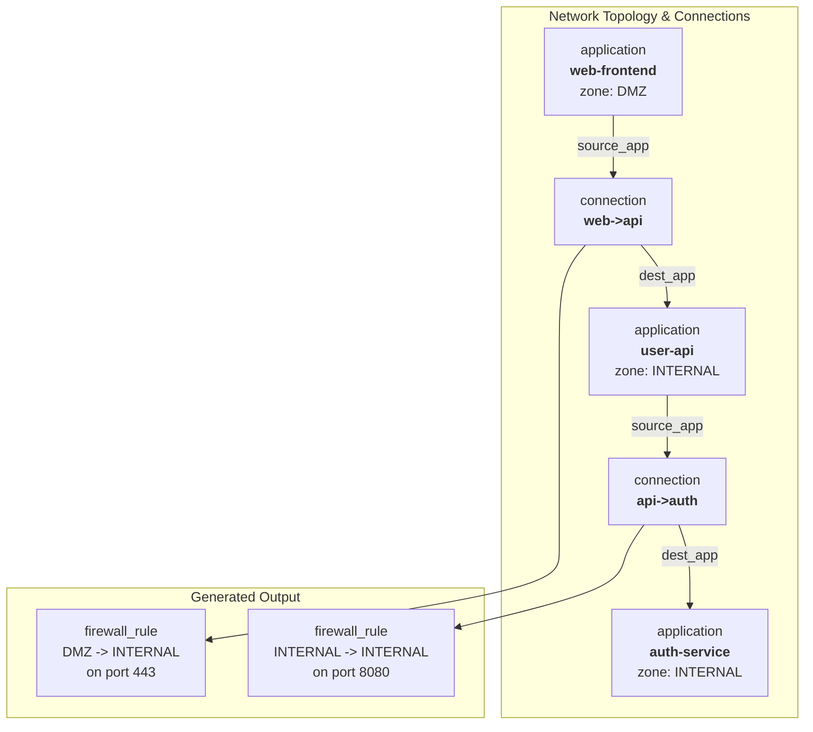

<p align="center">
  <a href="https://rescile.com" target="_blank" rel="noopener">
    
  </a>
</p>

<h1 align="center">rescile: Hybrid Cloud Controller</h1>

<p align="center">
  <strong>From Complexity to Clarity — Build a Living Blueprint of Your Hybrid World.</strong>
  <br><br>
  This repository contains the source for <a href="https://rescile.com">rescile.com</a>, including comprehensive documentation and real-world examples for modeling, governing, and automating your hybrid cloud.
</p>

## What is rescile?

rescile transforms scattered data from your hybrid environment into a single, queryable dependency graph. It creates a "digital twin" of your entire estate, allowing you to go from fragmented data to decisive answers.

With rescile, you can:

- **Generate Complete Deployment Recipes** for Terraform, Ansible, and Kubernetes.
- **Automate Audits** with compliance-as-code for SOX, GDPR, DORA, and more.
- **Achieve True FinOps Cost Attribution** by connecting technical assets to business owners.
- **Proactively Manage Risk** by tracing vulnerabilities from an SBOM to every affected application.
- **Enforce Architectural Standards** and validate your deployed reality against your blueprint.

## 🤝 Contributing

Contributions are welcome! Please feel free to submit a pull request or open an issue for bugs, feature requests, or suggestions.

---

<p align="center">
  Built with ❤️ by the team at <a href="https://rescile.com">rescile.com</a>
</p>

---

## Automating Firewall Rule Generation

Manually creating and maintaining firewall rules is a tedious and error-prone process. As applications evolve and new services are deployed, the firewall ruleset must be updated precisely. A mistake can lead to service outages or security vulnerabilities.

Rescile can automate the generation of a firewall matrix by modeling your applications, their network placements, and their communication patterns. This turns your architectural blueprint into a source of truth for your network security policy.

### The Model

1.  **Assets**: We define our applications, the servers they run on, the networks those servers belong to, and a crucial list of explicit connections between applications.
2.  **Model**: `model/*.toml` files are used to propagate network zone information up to the application level, so each application is aware of its security context (e.g., `DMZ`, `INTERNAL`).
3.  **Connections**: The importer automatically creates `connection` nodes from a CSV file. These nodes link to their source and destination applications, creating a model of traffic flow.
4.  **Output**: An `output/*.toml` file iterates over every `connection` and generates a structured `firewall_rule` resource containing all the necessary information: source, destination, port, and protocol.

### The Graph

The final graph contains a rich, traversable model of your application connectivity.



This graph can then be queried to generate a complete, accurate, and always-up-to-date firewall matrix.

### Complete Example: From Assets to Firewall Rules

Let's walk through a full example of generating firewall rules based on modeled application traffic.

#### 1. Asset Data (`data/assets/`)

We define the components of our application stack.

**`applications.csv`**
```csv
name,servers
web-frontend,web-server-01
user-api,api-server-01
auth-service,api-server-02
```

**`servers.csv`**
```csv
name,networks
web-server-01,dmz-prod
api-server-01,internal-prod
api-server-02,internal-prod
```

**`networks.csv`**
```csv
name,zone
dmz-prod,DMZ
internal-prod,INTERNAL
```

**`connections.csv`**
```csv
name,source_app,dest_app,dest_port,protocol
web-to-api,web-frontend,user-api,443,tcp
api-to-auth,user-api,auth-service,8080,tcp
```

#### 2.1. Architectural Model (`data/models/network_zones.toml`)

This model propagates the `zone` property from a `network` resource, through its connected `server`, and up to the `application`. This ensures each application node is aware of its security zone. This is achieved in a single step by using path traversal in the `from` selector of the `copy_property` rule, pulling the data from a distantly related node.

```toml
# Propagate the 'zone' property from a network, through its server, up to the application.
# This uses path traversal to find the related network for each application.
origin_resource = "applications"

[[copy_property]]
from = "servers.networks"
properties = [ "zone" ]
```

#### 2.2. Architectural Model (`data/models/connections.toml`)

This model establishes relationships between `connection` assets and the `application` assets they refer to. Since each connection has two distinct links to applications (a source and a destination), we use `link_resources` to create explicit, named relations (`source_app` and `dest_app`). These named relations are essential for the output template to traverse the graph and retrieve information from the correct source and destination applications.

```toml
origin_resource = "connections"

# Create a 'source_app' relation from a connection to its source application.
[[link_resources]]
with = "applications"
on = { local = "source_app", remote = "name" }
create_relation = { type = "source_app" }

# Create a 'dest_app' relation from a connection to its destination application.
[[link_resources]]
with = "applications"
on = { local = "dest_app", remote = "name" }
create_relation = { type = "dest_app" }
```

#### 3. Output Generation (`data/output/firewall_matrix.toml`)

This is where the magic happens. We iterate over every `connection` resource and generate a structured `firewall_rule`. The template leverages Rescile's path traversal capability to fetch data from related nodes. It follows the `source_app` and `dest_app` relations (created in the previous step) to access properties from the connected `application` resources, making the template clear and explicit.

```toml
origin_resource = "connections"

[[output]]
resource_type = "firewall_rule"
# Create a unique name for each rule.
name = "rule-{{ origin_resource.source_app[0].name }}-to-{{ origin_resource.dest_app[0].name }}"

# The template traverses the graph from the 'connection' node to its linked
# source and destination applications to gather all necessary info.
template = """
{
  "source_zone": "{{ origin_resource.source_app[0].zone }}",
  "source_app": "{{ origin_resource.source_app[0].name }}",
  "destination_zone": "{{ origin_resource.dest_app[0].zone }}",
  "destination_app": "{{ origin_resource.dest_app[0].name }}",
  "destination_port": "{{ origin_resource.dest_port }}",
  "protocol": "{{ origin_resource.protocol }}"
}
"""
```

#### 4. Generating the Matrix with GraphQL

After running the importer, we can query for all the `firewall_rule` resources.

**GraphQL Query**
```graphql
query GetFirewallRules {
  firewall_rule {
    name
    rule_web_frontend_to_user_api {
      protocol
      destination_port
      source_zone
      destination_app
      source_app
      destination_zone
    }
    rule_user_api_to_auth_service {
      source_zone
      destination_port
      source_app
      destination_zone
      destination_app
      protocol
    }
  }
}
}
```

**Result:**
```json
{
  "data": {
    "firewall_rule": [
      {
        "name": "firewall_rule",
        "rule_web_frontend_to_user_api": {
          "protocol": "tcp",
          "destination_port": "443",
          "source_zone": "DMZ",
          "destination_app": "user-api",
          "source_app": "web-frontend",
          "destination_zone": "INTERNAL"
        },
        "rule_user_api_to_auth_service": {
          "source_zone": "INTERNAL",
          "destination_port": "8080",
          "source_app": "user-api",
          "destination_zone": "INTERNAL",
          "destination_app": "auth-service",
          "protocol": "tcp"
        }
      }
    ]
  }
}
```

Using a simple `jq` command, we can transform this JSON into a clean, human-readable CSV format, which serves as our final firewall matrix.

**Command**
```bash
# GQL_QUERY='...' (from above)
# JQ_FILTER='(.data.firewall_rule[0] | del(.name) | values) | ["Source Zone", "Source App", "Dest Zone", "Dest App", "Dest Port", "Protocol"], (.[] | [.source_zone, .source_app, .destination_zone, .destination_app, .destination_port, .protocol]) | @csv'

# curl ... | jq -r "$JQ_FILTER"
```

**Generated `firewall_matrix.csv`**
```csv
"Source Zone","Source App","Dest Zone","Dest App","Dest Port","Protocol"
"INTERNAL","user-api","INTERNAL","auth-service","8080","tcp"
"DMZ","web-frontend","INTERNAL","user-api","443","tcp"
```

This matrix, generated directly from your architectural source of truth, can now be used to configure your firewall, fed into automation pipelines, or used for security audits, ensuring your network policy is always synchronized with your application architecture.
